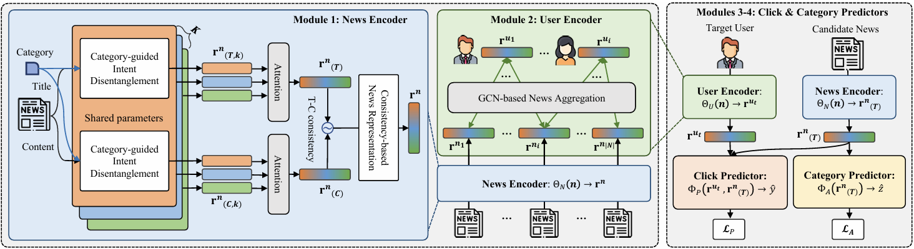

# [WWW'25] CROWN: A Novel Approach to Comprehending Users' Preferences for Accurate Personalized News Recommendation

## Overview of CROWN


## Available dataset
1. [MIND Dataset](https://msnews.github.io/)
2. [Adressa Dataset](https://reclab.idi.ntnu.no/dataset/)

## Datasets
|Datasets|# of Users|# of News|Avg. title len|Avg. body len|
|:---:|:---:|:---:|:---:|:---:|
|MIND|94,057|65,238|11.67|41.01|
|Adressa|601,215|73,844|6.63|552.15|

## Dependencies
Our code runs on the Intel i7-9700k CPU with 64GB memory and NVIDIA RTX 2080 Ti GPU with 12GB, with the following packages installed:
```
python 3.8.10
torch 1.11.0
torchtext 0.12.0
pandas
numpy
argparse
sklearn
```
## How to run
```
python main.py --news_encoder=CROWN --user_encoder=CROWN
```

## Experiments Results for Rebuttal

 1. The recommendation accuracy of CROWN with/without the category information in MIND and Adressa datasets.

### - *__MIND-small__*
|                      |  AUC  |  MRR  | nDCG@5 |  nDCG@10 |   
|----------------------|:-----:|:-----:|:------:|:--------:|
| CROWN   w/o category | 68.06 | 32.82 |  36.51 |   42.59  |
|  CROWN   w/ category | 68.23 | 33.54 |  36.97 | 42.93    |

### - *__Adressa__*
|                    |   AUC  |  MRR  | nDCG@5 | nDCG@10 |
|--------------------|:------:|:-----:|:------:|:-------:|
| CROWN w/o category |  83.85 | 52.84 |  55.33 |  60.35  |
|  CROWN w/ category | 84.13  | 53.93 |  56.64 |  61.15  |

---


 2. Training time (new) and AUC scores (reported at the submission) of three methods.

|         | NPA (Training time / AUC) | CNE-SUE (Training time / AUC) | **CROWN** (Training time / AUC) |
|---------|:-------------------------:|:-----------------------------:|:---------------------------:|
| *__MIND-small__*  |       382.07 / 65.42      |        1482.26 / 67.61        |       1301.89 / 68.23       |
| *__Adressa__* |       228.99 / 67.04      |        1034.67 / 80.74        |        957.46 / 84.13       |


---


3. The recommendation accuracy for cold-start users (# of clicked news articles <= 5) in MIND-small dataset.

|         |            AUC           |           MRR           |          nDCG@5         |         nDCG@10         |
|---------|:------------------------:|:-----------------------:|:-----------------------:|:-----------------------:|
|  LibFM  | 60.39 → 50.20 (-20.29%) | 28.35 → 25.09 (-12.99%) | 30.40 → 25.92 (-17.28%) | 36.58 → 32.09 (-13.99%) |
|   DSSM  |  62.35 → 58.32 (-6.91%) | 28.34 → 28.10  (-0.85%) | 30.94 → 30.36  (-1.91%) | 37.48 → 36.70  (-2.13%) |
|   NPA   |  65.42 → 60.22 (-8.64%) | 30.92 → 30.80  (-0.39%) | 34.08 → 33.51  (-1.70%) | 40.39 → 39.51  (-2.23%) |
|   NRMS  |  66.23 → 60.21 (-9.99%) | 31.34 → 31.23  (-0.35%) | 34.53 → 33.77  (-2.25%) | 41.35 → 39.76  (-1.48%) |
|   NAML  |  66.48 → 61.18 (-8.66%) | 31.42 → 31.39  (-0.10%) | 34.80 → 34.05  (-2.20%) | 41.12 → 40.17  (-2.36%) |
|  LSTUR  | 66.12 → 59.08 (-11.92%) | 31.21 → 30.03  (-3.93%) | 34.61 → 32.38  (-6.89%) | 40.56 → 38.61  (-5.05%) |
|   FIM   |  65.71 → 60.73 (-8.20%) | 30.93 → 30.66  (-0.88%) | 34.28 → 33.89  (-1.15%) | 40.47 → 39.59  (-2.22%) |
|  HieRec | 67.18 → 61.04 (-10.05%) | 31.69 → 31.28  (-1.31%) | 35.32 → 34.25  (-3.12%) | 41.61 → 39.86  (-4.39%) | 
| DIGAT w/o PLM |  67.13 → 58.26 (-15.22%) | 32.15 → 29.52 (-8.90%) | 35.64 → 32.08 (-11.09%) | 41.95 → 38.04 (-10.28%) |
| CNE-SUE | 67.61 → 59.85 (-12.97%) | 32.19 → 29.45  (-9.30%) | 35.72 → 32.75  (-9.07%) | 42.03 → 38.73  (-8.52%) |
|  CROWN  |  **68.23 → 62.86** (-8.54%)  | **33.54 → 32.54**  (-3.07%) | **36.97 → 35.78**  (-3.33%) | **42.93 → 41.50**  (-3.45%) |


---


4. The results of eight CROWN variants.

### - *__MIND-small__*
| (S1) | (S2) | (S3) |  AUC  |  MRR  | nDCG@5 |  nDCG@10 |
|:----:|:----:|:----:|:-----:|:-----:|:------:|:--------:|
|   X  |   X  |   X  | 66.24 | 31.39 |  34.84 |   40.95  |
|   O  |   X  |   X  | 67.25 | 32.01 |  35.46 |   41.71  |
|   X  |   O  |   X  | 67.31 | 31.92 |  35.58 |   41.82  |
|   X  |   X  |   O  | 66.84 | 31.82 |  35.35 |   41.51  |
|   X  |   O  |   O  | 67.64 | 32.24 |  35.67 |   41.94  |
|   O  |   X  |   O  | 68.06 | 32.82 |  36.51 |   42.59  |
|   O  |   O  |   X  | 67.93 | 32.46 |  36.11 |   42.3   |
|   O  |   O  |   O  | 68.23 | 33.54 |  36.97 | 42.93    |

### - *__Adressa__*
| (S1) | (S2) | (S3) |  AUC  |  MRR  | nDCG@5 | nDCG@10 |
|:----:|:----:|:----:|:-----:|:-----:|:------:|:-------:|
|   X  |   X  |   X  | 77.89 | 48.31 |  49.04 |  55.46  |
|   O  |   X  |   X  | 80.88 | 50.94 |  52.66 |  58.86  |
|   X  |   O  |   X  | 79.77 | 50.47 |  51.99 |  58.68  |
|   X  |   X  |   O  | 78.29 | 50.06 |  49.91 |  57.04  |
|   X  |   O  |   O  | 82.15 |   52  |  53.31 |  59.13  |
|   O  |   X  |   O  | 83.85 | 52.84 |  55.33 |  60.35  |
|   O  |   O  |   X  | 83.43 | 52.77 |  55.18 |  60.32  |
|   O  |   O  |   O  | 84.13 | 53.93 |  56.64 |  61.14  |

---


5. The improvement (%) of CROWN and CNE-SUE over their best competitors (i.e., CNE-SUE and NAML) in MIND and Adressa.

### - *__MIND-small__*
|                    | AUC (%) | MRR (%) | nDCG@5 (%) | nDCG@10 (%) | Time (s/it) |
|--------------------|:-------:|:-------:|:----------:|:-----------:|:-----------:|
| CROWN (vs CNE-SUE) |   0.91  |   4.19  |    3.49    |     2.14    |    1301.8   |
|  CNE-SUE (vs NAML) |   1.34  |   0.71  |     1.4    |     1.13    |      -      | 

### - *__Adressa__*
|                    | AUC (%) | MRR (%) | nDCG@5 (%) | nDCG@10 (%) | Time (s/it) |
|--------------------|:----:|:----:|:------:|:-------:|:-----:|
| CROWN (vs CNE-SUE) | 4.19 | 6.31 |  12.81 |   7.04  | 957.4 |
|  CNE-SUE (vs NAML) |   -  |   -  |    -   |    -    |  -    |

---


6. The hyper-parameters settings.

|          Hyper-parameters          | Setting |                                 Note                                 |
|:----------------------------------:|:-------:|:--------------------------------------------------------------------:|
|              optimizer             |   Adam  |                                   -                                  |
|            learning rate           |   1e-4  |                                   -                                  |
|             batch size             |    16   |                                   -                                  |
|         negative sampling M        |    4    |                                   -                                  |
|           early stopping           |    5    |                                   -                                  |
|            intent num K            |    3    |                                   -                                  |
| weight factor for auxiliary task β |   0.3   |                                   -                                  |
|          max title length          |    32   |    CNE-SUE: 32, NPA: 30, HieRec: 30, FIM: 20, 나머진 Not reported    |
|         max content length         |   128   | CNE-SUE: 128, CAST: 250, 나머지 CPRS, HyperNews, NAML은 Not reported |
|         max history length         |    50   |                                   -                                  |
|           word embedding           |   300   |                           pretrained Glove                           |
|       optimizer weight decay       |    0    |                                   -                                  |
|               dropout              |   0.2   |                                   -                                  |
|      isab inducing points num      |    4    |                                   -                                  |
|            isab head num           |    4    |                                   -                                  |

---
