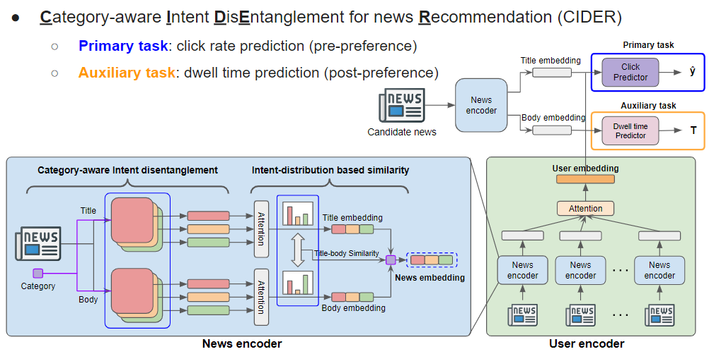

# [WWW'24] CIDER: Category-aware Intent Disentanglement for Accurate News Recommendations

## The overview of KHAN


## Available dataset
1. [MIND Dataset](https://msnews.github.io/)
2. [Adressa Dataset](https://reclab.idi.ntnu.no/dataset/)

## Datasets
|Datasets|# of Users|# of News|Avg. title len|Avg. body len|
|:---:|:---:|:---:|:---:|:---:|
|MIND|94,057|65,238|11.67|41.01|
|Adressa|601,215|73,844|6.63|552.15|

## Dependencies
Our code runs on the Intel i7-9700k CPU with 64GB memory and NVIDIA RTX 2080 Ti GPU with 12GB, with the following packages installed:
```
python 3.8.10
torch 1.11.0
torchtext 0.12.0
pandas
numpy
argparse
sklearn
```
## How to run
```
python main.py --news_encoder=CIDER --user_encoder=CIDER
```

## Experiments Results
|Dataset|# of articles|Class distribution|
|:---:|:---:|:---:|
|SemEval|645|407/238|
|AllSides-S|14.7k|6.6k/4.6k/3.5k|
|AllSides-L|719.2k|112.4k/202.9k/99.6k/62.6k/241.5k|
